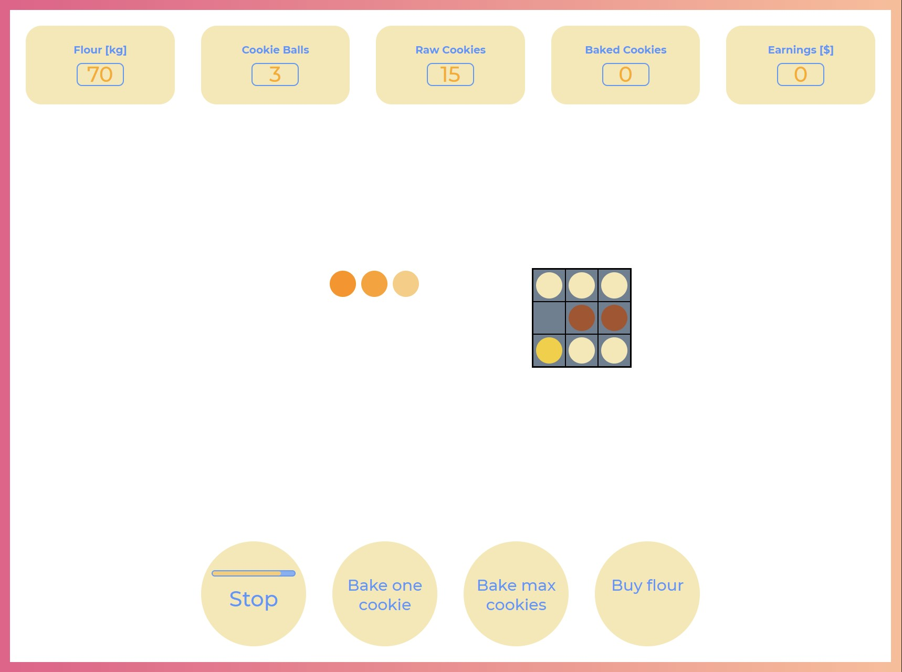

# Bring me cookies!!!

Let's try to mimic a popular game from `idle games` genre - [Cookie Clicker](http://orteil.dashnet.org/cookieclicker/), using pure HTML, CSS and JS.

---
## Premise

You run a bakery and your job is to make as many cookies as possible using:

    - old grid furnace,
    - 100kg of flour,
    - magical recipe for making cookies using only flour, (using only 10kg of flour you are able to make 20 raw cookies / 1 big dough ball)
----
## The Process

Process of making cookies is complex and consists of these steps;

    1) Prepare a dough ball.
    2) Make raw cookies out of the dough ball.
    3) Put cookies into the grid furnace.
---
## Implementation

### Task 1
----
    a) There should be a button that can start a process of making a dough balls

    b) There should be a making dough ball progress bar that starts to fill up upon pressing the Make dough ball button.

    c) The process of making the dough balls should take 4 seconds, the process shuld be stoppable.

### Task 2
----
Dough can be made only if there are ingredients

    a) There should be a visible counter of available flour.

    b) Dough balls can be made only if at least 10kg of flour is available.

    c) There should be a visible counter of available dough balls.

    d) Update flour amount and dough balls appropriately after making new dough ball.

### Task 3
----
Raw cookies can be made.

    a) Dough balls should visible and clickable.

    b) One click on the dough ball makes one Raw cookies and changes dough ball's gradient color.

    c) After making 20 raw cookies from one dough ball, the ball is used up and should vanish.

    d) There should be a visible counter of available raw cookies.

    e) Update dough balls and raw cookies amount appropriately.

### Task 4
---
Raw cookies need to be put in the grid oven and baked

    a) There should be "Bake one cookies" and "Bake max cookies" buttons.

    b) The grid oven should be visible with 9 slots for cookies.

    c) The new buttons should work adequately to their names (put appropriate amount of cookies to the oven).

    d) Slots in the grid oven should be filled with cookies upon pressing the appropriate buttons.

    d) The new buttons should display message "No cookies to bake" if there are no raw cookies to bake.

    e) Update displayed ingredients amounts.

### Task 5
---
Oven should bake cookies inside of it.

    a) Oven should gradually bake cookies inside of itself and change their color.

    b) Cookies in the oven should change their color based on time spent inside;

    - 0-3 sec (yellowish)
    - 3-6 sec (orange)
    - 3-9 sec (brown)
    - 9-12 sec (black)

    c) If cookie spent too much time in the oven it should vanish

    d) Cookies in the oven should be clickable, if cookie is brown after clicking it should add up to the new counter "Baked cookies".

    e) Cookies in the oven while being a different color than brown upon clicking should disappear and not add up to Baked cookies counter

### Task 6
---
Baked cookies should be sold.

    a) Baked cookies (if available) should be sold in random time intervals between 3-6 seconds and random amount between 1 - 10 cookies.

    b) The price for a single cookie should be 5$, if selling more than 5 in one transaction the price should be 4$ (discount).

    c) The amount of earned money should be displayed.

### Task 7
----
More flour is needed.

    a) There should be a button that enables buying more flour (100kg) for 50$.

Bon Appetit :D
